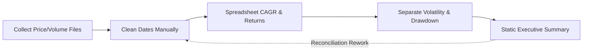
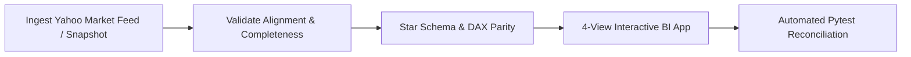

# AS-IS / TO-BE Process Mapping & Gap Analysis — Executive Equity Performance & Risk Analytics

## AS-IS: Fragmented Equity Analysis

```mermaid
flowchart LR
    A[Collect Price/Volume Files] --> B[Clean Dates Manually] --> C[Spreadsheet CAGR & Returns] --> D[Separate Volatility & Drawdown] --> E[Static Executive Summary]
    E -.->|Reconciliation Rework| B
```

## TO-BE: Integrated Executive Equity Intelligence

```mermaid
flowchart LR
    A[Ingest Yahoo Market Feed / Snapshot] --> B[Validate Alignment & Completeness] --> C[Star Schema & DAX Parity] --> D[4-View Interactive BI App] --> E[Automated Pytest Reconciliation]
```
