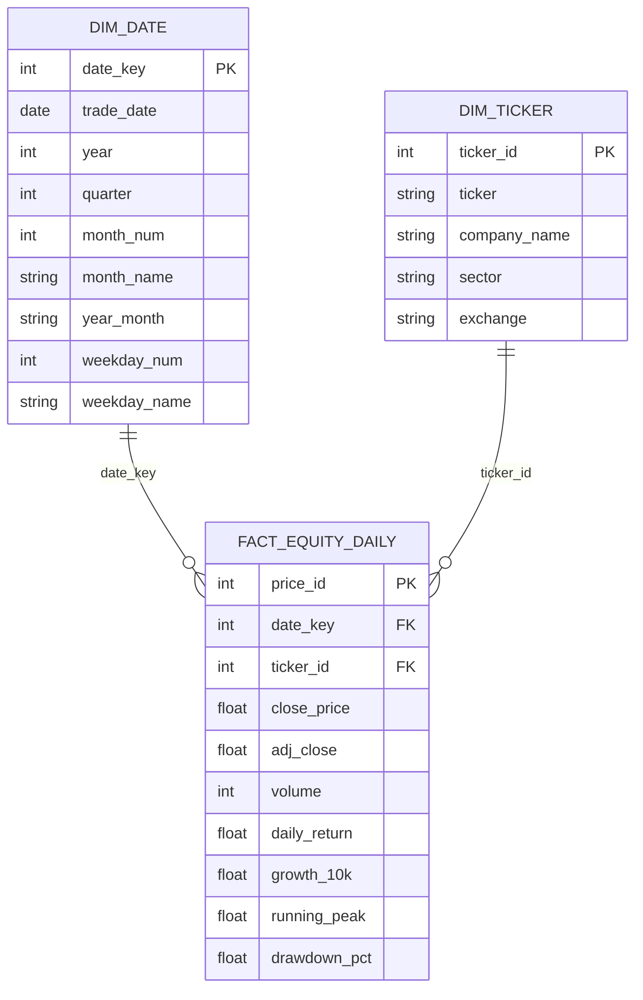

# Power BI Star Schema Data Model — Executive Equity Performance & Risk Analytics

```mermaid
erDiagram
    DIM_DATE ||--o{ FACT_EQUITY_DAILY : "date_key"
    DIM_TICKER ||--o{ FACT_EQUITY_DAILY : "ticker_id"

    DIM_DATE {
        int date_key PK
        date trade_date
        int year
        int quarter
        int month_num
        string month_name
        string year_month
        int weekday_num
        string weekday_name
    }
    DIM_TICKER {
        int ticker_id PK
        string ticker
        string company_name
        string sector
        string exchange
    }
    FACT_EQUITY_DAILY {
        int price_id PK
        int date_key FK
        int ticker_id FK
        float close_price
        float adj_close
        int volume
        float daily_return
        float growth_10k
        float running_peak
        float drawdown_pct
    }
```
